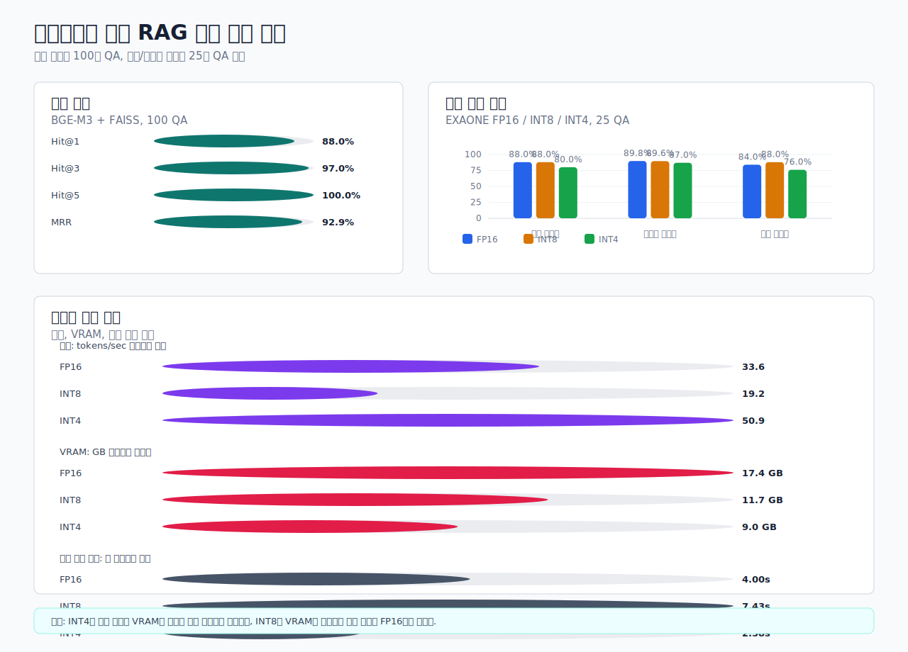

# Evaluation Performance Visualization

## Retrieval Evaluation

- QA count: `100`
- Hit@1: `0.8800`
- Hit@3: `0.9700`
- Hit@5: `1.0000`
- MRR: `0.9292`

## Quantization Evaluation

| quantization | answer pass | citation | keyword recall | tokens/sec | generation sec | max VRAM GB |
| --- | ---: | ---: | ---: | ---: | ---: | ---: |
| fp16 | 0.8400 | 0.8800 | 0.8980 | 33.5938 | 4.0016 | 17.3980 |
| int8 | 0.8800 | 0.8800 | 0.8960 | 19.1897 | 7.4312 | 11.7460 |
| int4 | 0.7600 | 0.8000 | 0.8700 | 50.9247 | 2.5760 | 8.9960 |

## Note

- Retrieval was evaluated on 100 QA pairs.
- EXAONE generation and quantization were evaluated on 25 QA pairs.
- INT8 reduces VRAM but is slower in this batch-1 RAG setting; INT4 is fastest and lightest but has lower answer quality.
