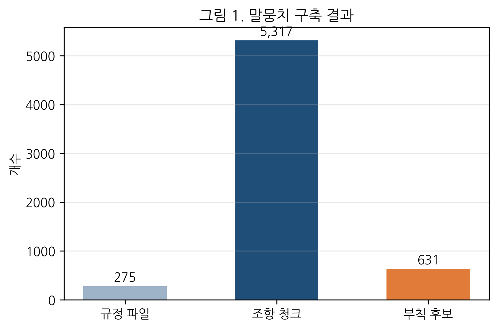
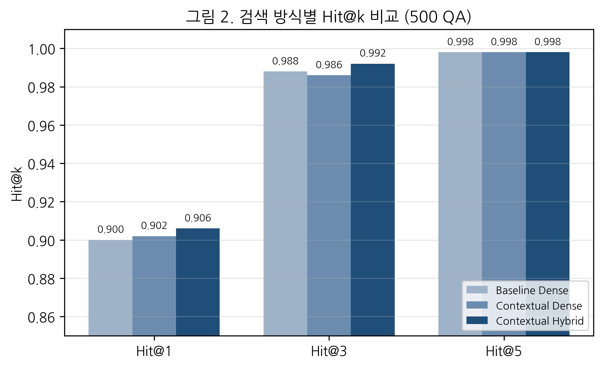
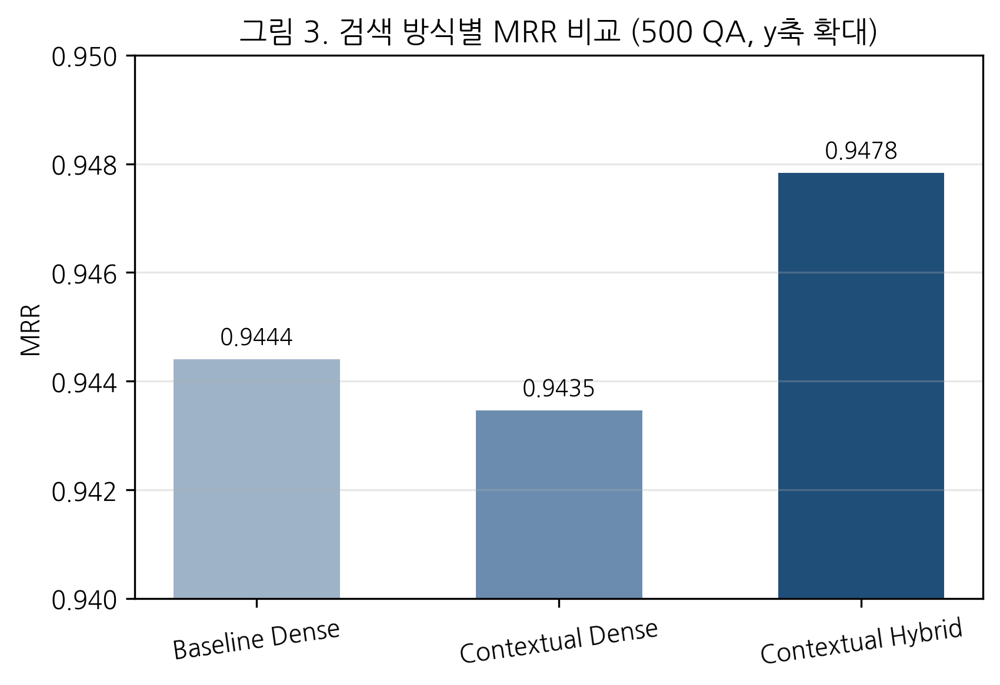
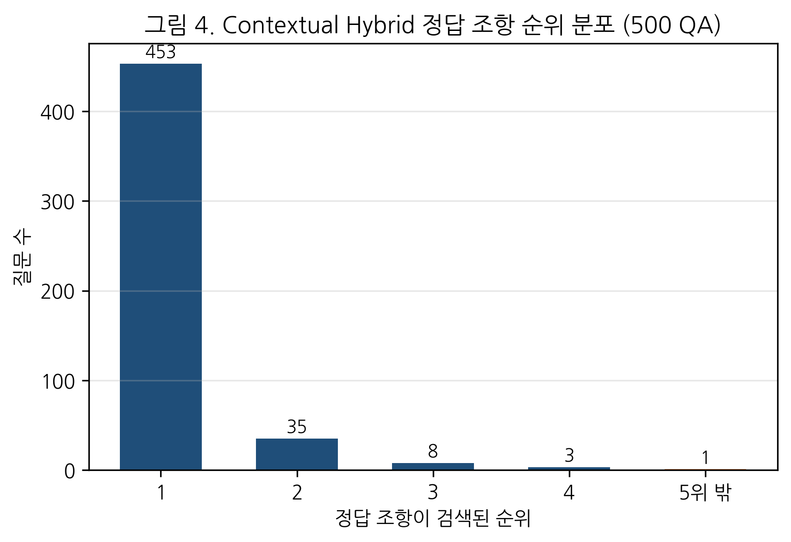
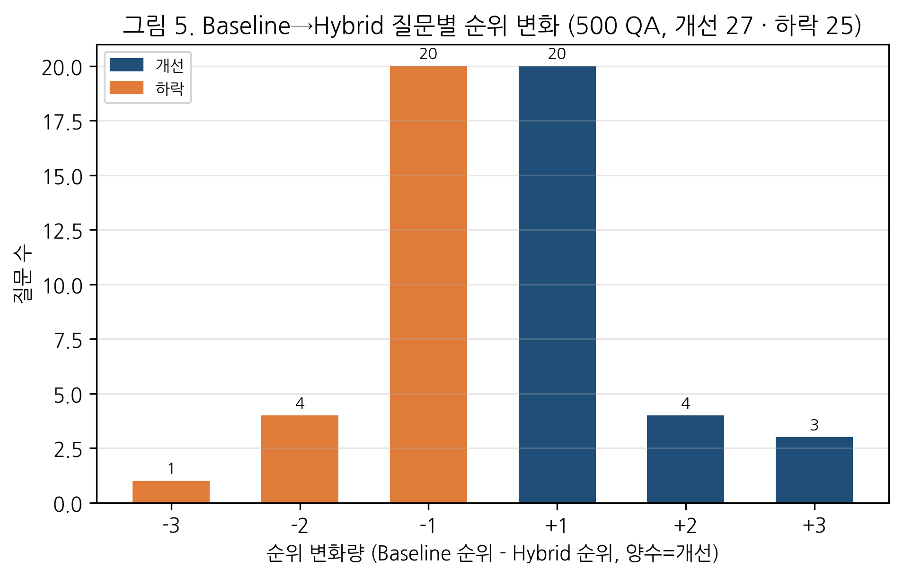
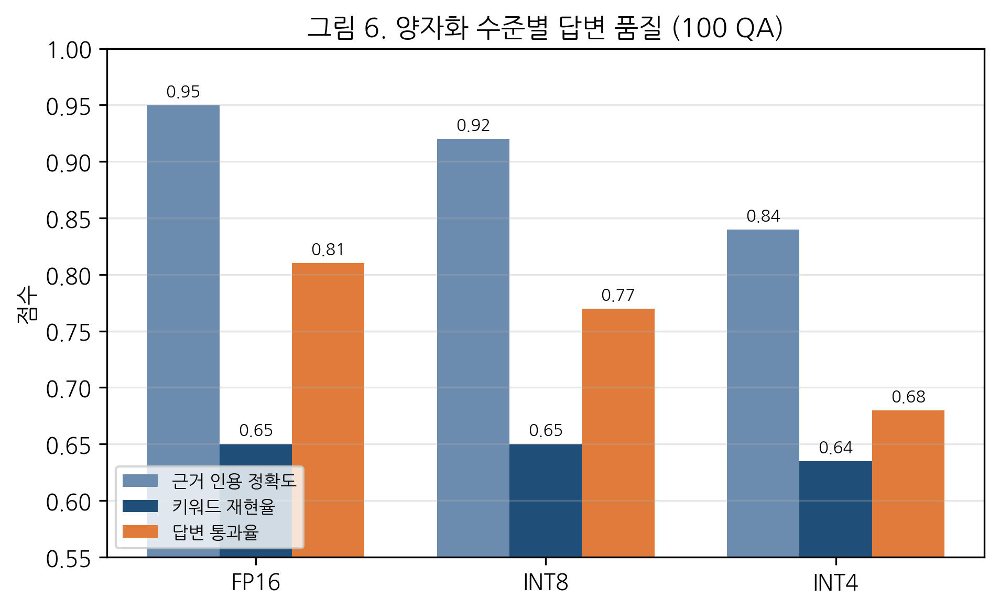
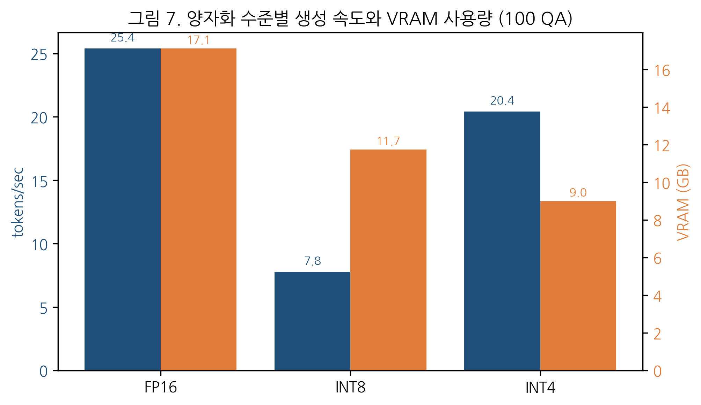

# 양자화된 LLM 기반 제주대학교 규정 RAG 시스템 구축

**학번:** 2021108112  
**성명:** 정내혁  
**프로젝트명:** Context-Augmented Chunking 기반 제주대학교 규정 RAG 검색 성능 개선  
**작성일:** 2026년 6월 16일

<!-- PAGEBREAK -->

## 초록

본 프로젝트는 제주대학교 규정집 전체를 대상으로 사용자의 규정 관련 질문에 정확한 근거 조항과 함께 답변하는 한국어 RAG 시스템을 구축하는 것을 목표로 한다. 대학 규정은 규정 수가 많고 조항 구조가 유사하며, “위원회”, “임기”, “수당”, “징계”, “휴직”, “목적”, “정의”와 같이 반복되는 표현이 많다. 일반 LLM에 바로 질의하면 존재하지 않는 조항을 만들어내거나 근거를 명확히 제시하지 못하는 문제가 발생할 수 있다. 따라서 본 프로젝트에서는 규정 원문을 수집하고 조항 단위로 구조화한 뒤, 검색된 근거 조항에 기반해 EXAONE-3.5가 답변을 생성하도록 구성하였다.

기본 시스템은 제주대학교 규정집 다운로드 페이지에서 총 275개 규정 파일을 수집하고, HWP/PDF 원문을 텍스트로 추출한 뒤, 제N조 단위로 5317개 조항 청크를 구축하였다. 이후 BGE-M3 기반 dense retrieval, FAISS 인덱스, EXAONE-3.5-7.8B-Instruct, FP16/INT8/INT4 양자화 실험, Streamlit 대시보드를 구현하였다. 추가 개선으로는 Context-Augmented Chunking을 적용하였다. 이 방식은 검색용 텍스트에는 규정명, 상위분류, 장/절, 목적 요약 등 문서 맥락을 포함하고, 답변과 화면 표시에는 원문 조항만 사용하도록 분리한 것이다.

평가는 검색 500개 QA, 생성 100개 QA로 확장하여 17개 카테고리·207개 규정을 포괄하도록 구성하였다. 500개 QA 검색 평가 결과, baseline dense 검색은 Hit@1 0.900, Hit@3 0.988, Hit@5 0.998, MRR 0.9444를 보였다. 최종 개선안인 Contextual Hybrid 검색은 Hit@1 0.906, Hit@3 0.992, Hit@5 0.998, MRR 0.9478을 기록하여 baseline 대비 Hit@1·Hit@3·MRR이 모두 개선되었다. 100개 QA 생성 평가에서는 FP16이 근거 인용 정확도 0.95, 답변 통과율 0.81로 가장 안정적이었고, INT4는 VRAM 9.0GB로 가장 가벼웠으나 근거 인용 정확도 0.84, 답변 통과율 0.68로 떨어졌다. 특히 INT4는 100개 답변 중 37개에서 프롬프트의 “근거: 규정명 조문” 자리표시자를 실제 규정명으로 복원하지 못하는 instruction-following 저하를 보였다.

<!-- PAGEBREAK -->

## 1. 서론

대학 규정은 학칙, 학사관리, 장학, 교원, 직원, 연구, 위원회, 시설 운영 등 대학 구성원이 준수해야 하는 제도적 근거를 담고 있다. 그러나 규정 문서는 일반 사용자가 직접 탐색하기 어렵다. 규정집은 여러 개의 파일로 나뉘어 있고, 각 파일은 다시 수십 개 조항으로 구성된다. 사용자가 “외국인 유학생은 기숙사를 제공받을 수 있는가”, “장학금은 어떤 학생에게 지급할 수 있는가”, “복수전공은 어떻게 정의되는가”와 같은 질문을 할 때, 관련 규정을 직접 찾고 조항 번호까지 확인하는 과정은 번거롭다.

최근 LLM은 자연어 질의응답에 강점을 보이지만, 규정 질의응답에서 LLM만 사용하는 방식은 위험하다. LLM은 확률적으로 문장을 생성하므로, 실제 규정에 없는 내용을 그럴듯하게 답하거나 조항 번호를 잘못 인용할 수 있다. 특히 법령·규정·학칙과 같이 근거가 중요한 문서에서는 답변의 자연스러움보다 근거 충실도가 중요하다. 따라서 본 프로젝트는 LLM이 임의로 답하지 않도록 검색 단계에서 관련 조항을 먼저 찾고, LLM은 검색된 조항만 근거로 답변하도록 제한하는 RAG 구조를 채택하였다.

본 프로젝트의 핵심 목표는 두 가지이다. 첫째, 제주대학교 규정집 전체를 조항 단위 말뭉치로 구축하고, 질의에 맞는 근거 조항을 안정적으로 검색하는 것이다. 둘째, 한국어 특화 LLM인 EXAONE-3.5-7.8B-Instruct에 양자화를 적용하여 추론 속도와 자원 효율성을 비교하는 것이다. 추가로 검색 정확도를 높이기 위해 Context-Augmented Chunking을 적용하였다. 이는 단순 조항 본문만 임베딩하는 것이 아니라, 각 조항에 문서 수준 맥락을 함께 부착하여 검색기가 해당 조항이 어떤 규정 체계에 속하는지 더 잘 파악하도록 하는 방법이다.

<!-- PAGEBREAK -->

## 2. 프로젝트 목표와 범위

본 프로젝트의 범위는 데이터 수집, 말뭉치 구축, 검색 인덱스 구축, LLM 답변 생성, 양자화 비교, 데모 대시보드 구현, 검색 성능 개선 실험까지이다. 최종 제출물은 `Data` 폴더, `requirements.txt`, `main.py`, `README.md`, `viz.py` 및 보조 스크립트를 포함하는 형태로 구성할 수 있도록 하였다.

구체적인 구현 목표는 다음과 같다. 첫째, 제주대학교 규정집 전체 페이지에서 규정 파일을 다운로드하고 원본 파일을 보존한다. 둘째, HWP/PDF에서 텍스트를 추출하고 제N조 단위로 청킹한다. 셋째, 각 조항에 규정명, 조 번호, 조 제목, 출처 파일, 다운로드 URL 등의 메타데이터를 부착한다. 넷째, BGE-M3 임베딩과 FAISS를 이용해 dense 검색 인덱스를 구축한다. 다섯째, EXAONE-3.5-7.8B-Instruct를 FP16/INT8/INT4로 실행하여 생성 품질과 효율성을 비교한다. 여섯째, 사용자가 질문을 입력하면 답변, 근거 조항, 검색 후보 유사도를 확인할 수 있는 Streamlit 대시보드를 제공한다.

검색 성능 개선의 범위는 Context-Augmented Chunking과 Hybrid 검색까지로 설정하였다. Reranker는 인터페이스와 옵션을 마련했지만, 서버 캐시에 해당 모델이 존재하지 않아 최종 정량 결과에는 포함하지 않았다. 또한 본 프로젝트는 LLM fine-tuning을 수행하지 않는다. 규정 질의응답의 목적상 모델을 학습시키기보다, 검색된 근거를 정확히 제공하고 LLM이 그 근거 안에서 답하도록 제한하는 편이 안정적이기 때문이다.

## 3. 데이터 수집 및 말뭉치 구축

데이터 출처는 제주대학교 규정집 전체 페이지이다. 수집 스크립트는 HTML에서 다운로드 링크를 파싱하고, `/cs/download.htm?act=download&seq=...&no=...` 형태의 링크를 절대 URL로 정규화하였다. 파일명은 `Content-Disposition` 헤더를 우선 사용하고, 한글 파일명을 URL decode한 뒤 파일 시스템에서 안전한 이름으로 정리하였다. 원본 파일은 `data/raw_hwp/`에 저장하였다.

수집 결과 총 275개 규정 파일이 manifest에 기록되었고, 다운로드 상태가 정상인 파일은 275개였다. 추출 단계에서는 HWP5 OLE 구조를 직접 읽어 `FileHeader`와 `BodyText/Section*` 스트림을 순회하였다. 압축된 스트림은 zlib raw deflate 방식으로 해제하고, 텍스트 레코드에서 UTF-16LE 본문을 추출하였다. PDF 파일은 별도의 PDF 텍스트 추출 경로를 사용하였다. 추출된 텍스트는 `data/text/`에 저장하고, 추출 상태와 글자 수는 `extract_report.json`에 기록하였다.

조항 청킹은 `제1조`, `제2조`, `제2조의2` 등 조 번호 패턴을 기준으로 수행하였다. 기존 baseline은 조항 원문 중심의 `articles.jsonl`을 생성하였다. 이후 개선 실험을 위해 `articles_contextual.jsonl`을 별도로 생성하였다. 이 파일은 기존 baseline을 덮어쓰지 않으며, 각 조항에 `embedding_text`와 `display_text`를 분리해 저장한다. 최종 contextual 말뭉치에는 5317개 조항이 포함되었고, 부칙 후보는 631개로 파악되었다. 한편 수집된 275개 파일 중 59개는 “이 규정을 폐지한다”만 담은 폐지 규정 또는 편집기준 문서로, 조항이 추출되지 않았다. 따라서 실제 조항을 보유한 활성 규정은 216개이며, 후술하는 평가셋은 이 중 207개 규정을 포괄한다.

<!-- PAGEBREAK -->

## 4. Baseline RAG 시스템 설계

Baseline RAG 시스템은 조항 단위 청킹, BGE-M3 임베딩, FAISS dense 검색, EXAONE 답변 생성으로 구성된다. 각 조항은 규정명, 조 번호, 조 제목, 본문, 출처 파일, 다운로드 URL을 포함한다. 검색용 텍스트는 규정명, 조문 정보, 본문을 결합하여 구성하였다. 이후 BGE-M3를 이용해 각 조항을 1024차원 벡터로 임베딩하고, cosine similarity와 동일하게 사용할 수 있도록 정규화한 뒤 FAISS `IndexFlatIP`에 저장하였다.

사용자 질의가 입력되면 동일한 임베딩 모델로 질의를 벡터화하고, FAISS에서 top-k 조항을 검색한다. LLM을 사용하지 않는 경우에는 상위 근거 조항을 기반으로 간단한 추출형 답변을 제공한다. LLM을 사용하는 경우에는 “주어진 근거 조항만 사용하고, 근거가 부족하면 찾을 수 없음이라고 답하라”는 시스템 지침과 함께 검색 결과를 프롬프트에 삽입한다. 이때 LLM에게 전달되는 근거는 조항 원문과 규정명·조 번호 중심으로 구성된다.

Baseline 구조의 장점은 단순하고 근거 인용이 명확하다는 점이다. 그러나 대학 규정은 유사한 조항 제목과 문구가 반복되므로, 조항 본문만으로는 문서 수준 맥락이 부족할 수 있다. 예를 들어 “목적”, “정의”, “위원회 구성”, “기능”, “수당” 같은 조항 제목은 여러 규정에서 반복된다. 이런 경우 검색기가 본문 표현만 보고 잘못된 규정의 조항을 상위에 올릴 가능성이 있다.

## 5. Context-Augmented Chunking 개선

Context-Augmented Chunking은 각 조항 청크에 문서 수준 맥락을 부착하는 방식이다. 본 프로젝트에서는 검색용 텍스트와 답변용 텍스트를 분리하였다. `embedding_text`는 조항 원문에 규정명, 상위분류, 장/절/관, 조문 메타데이터, 규정 목적 요약을 덧붙인 검색 전용 텍스트이다. `display_text`는 사용자에게 보여주고 LLM에게 최종 근거로 제공하는 원문 조항이다. 이 분리를 통해 검색기는 더 많은 맥락을 활용하되, 답변의 근거는 원문 조항으로 유지할 수 있다.

초기 실험에서는 문서 맥락을 조항 앞에 배치하였다. 그러나 “이 규정은 무엇을 목적으로 하는가”와 같은 질문에서 목적 요약이 모든 조항에 반복되어, 제1조(목적)가 아닌 같은 규정의 다른 조항이 상위에 검색되는 문제가 발생하였다. 따라서 최종 구현에서는 원문 조항을 먼저 배치하고, 문서 맥락을 뒤에 추가하였다. 이 방식은 조항 본문 의미를 우선 보존하면서도 문서 수준 정보를 보조적으로 제공한다.

규정 구조 파싱에서는 `제N장`, `제N절`, `제N관` 패턴을 인식하여 뒤따르는 조항의 메타데이터로 부착하였다. 또한 `제1조(목적)` 또는 제목에 “목적”이 포함된 조항을 우선적으로 규정 목적 요약으로 사용하였다. 목적 조항이 없는 경우에는 규정명과 초반 조항 제목을 이용해 deterministic fallback 요약을 생성하였다. 부칙은 별도로 탐지하되, 일반 조항 평가에는 포함하지 않았다.

<!-- PAGEBREAK -->

## 6. Hybrid 검색 및 파이프라인 개선

Contextual Dense 검색은 `embedding_text`를 BGE-M3로 임베딩한 FAISS 인덱스를 사용한다. 여기에 BM25를 결합한 Contextual Hybrid 검색도 구현하였다. BM25는 외부 형태소 분석기 없이 한글·영문·숫자 토큰을 정규식으로 추출하는 pure-Python 방식으로 구현하였다. Dense score와 BM25 score는 각각 min-max 정규화한 뒤 가중합으로 결합한다.

실험 결과 BM25 가중치가 과도하면 반복 단어가 많은 조항이 상위로 올라오는 문제가 있었다. 예를 들어 “복수전공 정의” 질문에서 BM25는 “복수전공”이라는 단어가 많이 반복되는 신청·선발 조항을 강하게 선호하였다. 이 부작용은 단순한 우려가 아니라 9.1절의 500개 QA 평가에서도 그대로 재현되었으며, 따라서 최종 기본값은 dense 0.9, BM25 0.1로 설정하였다. 이 값은 semantic retrieval을 주로 사용하면서도, 규정명·조항명과 같은 exact match 신호를 보조적으로 반영한다.

개선 후 검색 파이프라인은 다음과 같다. 사용자가 질문을 입력하면 질의를 임베딩하고 FAISS에서 후보를 검색한다. Hybrid 모드에서는 BM25 후보도 계산하여 dense score와 결합한다. 이후 최종 top-k 조항을 선택하고, LLM 프롬프트에는 `display_text`만 제공한다. 대시보드에서는 Baseline Dense, Contextual Dense, Contextual Hybrid, Contextual Hybrid + Reranker 모드를 선택할 수 있도록 하였다.

## 7. LLM 선택 및 양자화

LLM은 한국어 문서 질의응답에 적합한 EXAONE-3.5-7.8B-Instruct를 사용하였다. 해당 모델은 instruction-following 능력을 갖춘 한국어 특화 LLM이며, 규정 질의응답에서 자연어 답변을 생성하는 역할을 한다. 모델은 Hugging Face 캐시를 `/ceph_data/wq1880/Gen_AI/hf_cache`에 저장하여 홈 디렉터리 용량 부담을 줄였다.

양자화 실험은 FP16, INT8, INT4 세 조건으로 수행하였다. FP16은 기준 성능과 안정성을 확인하기 위한 baseline이다. INT8과 INT4는 bitsandbytes 기반 양자화를 적용하여 VRAM 사용량과 생성 속도 변화를 확인하였다. 일반적으로 양자화는 메모리 사용량을 줄일 수 있지만, 항상 속도 향상을 보장하지는 않는다. 본 실험에서도 INT8은 VRAM은 감소했지만 평균 생성 시간은 오히려 가장 길었다. 이는 8bit 연산 과정에서 dequantization 및 커널 오버헤드가 발생하고, 해당 모델·GPU·라이브러리 조합에서 FP16 Tensor Core 경로보다 효율적이지 않았기 때문으로 해석된다.

LLM은 검색 결과를 그대로 믿고 답변하기 때문에, 생성 품질은 검색 품질에 크게 의존한다. 따라서 양자화 실험은 단순 생성 속도뿐 아니라 근거 인용 정확도와 키워드 재현율을 함께 평가하였다. 최종 시스템에서는 사용 가능한 VRAM과 품질 요구에 따라 FP16 또는 INT4를 선택할 수 있도록 하였다.

<!-- PAGEBREAK -->

## 8. 평가 설계

### 8.1 평가셋 구성

초기 평가셋은 검색 100개·생성 25개 QA였으나, 규정 전체의 대표성을 확보하기 위해 검색 500개·생성 100개로 확장하였다. 확장은 다음 절차를 따랐다.

첫째, 활성 규정 216개의 실질 조항을 카테고리·규정별로 균형 샘플링하였다. 규정당 최대 4개 조항으로 상한을 두고 카테고리·규정을 라운드로빈으로 순회하여, 최종 검색셋이 17개 카테고리·207개 규정을 포괄하도록 하였다(기존 100개 QA는 11개 규정에 집중되어 있었다).

둘째, 채점에 사용되는 라벨은 원문 조항에서 결정론적으로 추출하였다. 기대 규정명·조 번호는 샘플링된 조항 그 자체에서 가져오고, 기대 키워드는 조항 본문의 단어 빈도와 코퍼스 역문서빈도(tf-idf)를 결합해 상위 변별 토큰을 뽑은 뒤 조사·형식어를 정제하여 구성하였다. 참조 답변은 조항 본문에서 발췌하였다. 질문 문장만 사람이 작성하므로, 질문 생성 모델의 품질이 정답 라벨을 오염시키지 않는다.

셋째, 평가에 부적절한 조항은 제외하였다. 구체적으로 (1) 규정명에 “폐지”가 포함된 규정, (2) 시행일·경과조치처럼 여러 규정에 동일하게 등장하여 검색으로 구분이 불가능한 부칙 본문(최대 42개 규정이 동일한 “제1조(시행일)” 본문을 공유), (3) “~생략~ 개정한다” 형태의 개정 래퍼 조항을 배제하였다. 또한 HWP 표 추출 과정에서 끼어든 깨진 문자를 정제하였다.

생성 평가셋 100개는 검색셋의 부분집합으로, 기대 키워드가 3개 이상이고 사실 확인형 내용을 담은 조항을 카테고리 균형을 고려해 선별하였다.

### 8.2 평가 지표

검색 평가지표는 Hit@1, Hit@3, Hit@5, MRR을 사용하였다. Hit@k는 정답 조항이 상위 k개 후보 안에 포함되는지를 의미하며, MRR은 정답 조항이 처음 등장한 순위의 역수를 평균한 값으로 정답의 평균 순위가 높을수록 1에 가까워진다.

생성 평가는 100개 QA에 대해 수행하였다. 생성 결과가 기대 규정명과 조 번호를 포함하는지 확인하여 근거 인용 정확도를 계산하였다. 또한 기대 키워드가 답변에 얼마나 포함되는지 키워드 재현율을 계산하고, 근거 인용을 만족하면서 키워드 재현율이 0.5 이상인 경우를 답변 통과로 보았다. 이 평가는 완전한 인간 평가를 대체하지는 않지만, 제출 전 모델 비교와 회귀 확인에는 유용하다.

효율성 평가는 평균 생성 시간, 초당 생성 토큰 수, GPU 최대 메모리 사용량을 기준으로 비교하였다. 공용 GPU 서버 환경을 고려하여 모든 GPU 실행 스크립트는 실행 전 `nvidia-smi` 상태를 출력하고, 추론·평가 작업은 빈 GPU를 자동 선택하며 프로세스명이 `neahyuk`으로 표시되도록 구성하였다. 장시간 학습 작업은 별도 정책으로 사용자에게 GPU 번호와 개수를 먼저 확인한 뒤 실행하도록 정리하였다.

<!-- PAGEBREAK -->

## 9. 실험 결과

### 9.1 검색 성능

500개 QA에 대한 검색 방식별 성능은 다음과 같다.

| 검색 방식 | Hit@1 | Hit@3 | Hit@5 | MRR | Dense 가중치 |
| --- | --- | --- | --- | --- | --- |
| Baseline Dense | 0.9000 | 0.9880 | 0.9980 | 0.9444 | - |
| Contextual Dense | 0.9020 | 0.9860 | 0.9980 | 0.9435 | - |
| Contextual Hybrid | 0.9060 | 0.9920 | 0.9980 | 0.9478 | 0.9 |

Baseline Dense는 Hit@1 0.900, Hit@3 0.988, Hit@5 0.998, MRR 0.9444를 기록하였다. Contextual Dense는 Hit@1이 0.902로 소폭 높았으나 Hit@3·MRR은 baseline과 거의 동일하였다. 최종 개선안인 Contextual Hybrid는 dense weight 0.9에서 Hit@1 0.906, Hit@3 0.992, Hit@5 0.998, MRR 0.9478을 기록하여 세 방식 중 Hit@1·Hit@3·MRR 모두에서 가장 우수하였다. 평가셋을 100개에서 500개로 5배 확장하고 207개 규정으로 넓혔음에도 Hybrid의 우위가 일관되게 유지되어, 기존 100개 QA 결과(Hybrid Hit@3·MRR 소폭 우위)보다 신뢰도가 높은 근거를 제공한다.

Contextual Hybrid에서 정답 조항이 검색된 순위를 보면, 500개 질문 중 453개는 1위, 35개는 2위, 8개는 3위, 3개는 4위로 검색되었고, top-5 안에서 찾지 못한 질문은 단 1개였다. 상위권 집중도가 매우 높아, 실제 사용자가 첫 화면에서 정답 조항을 바로 확인할 가능성이 크다.

다만 “MRR 개선”이라는 요약 지표 뒤에는 질문 단위의 트레이드오프가 존재한다. Baseline Dense와 Contextual Hybrid의 질문별 정답 순위를 직접 비교하면, 27개 질문은 순위가 상승하고 25개 질문은 하락하였다. 최종 MRR이 baseline보다 높은 것은 상승한 질문들의 개선 폭이 하락한 질문들의 손실 폭보다 컸기 때문이며, Hybrid가 모든 질문을 일률적으로 개선한 것은 아니다.

순위가 하락한 대표 사례는 “복수전공 이수 규정에서 복수전공은 어떻게 정의되나요?”(qa_037)이다. 정답은 “2. 복수전공 이수에 관한” 규정의 제2조(정의)인데, Baseline Dense에서는 1위로 검색되었으나 Contextual Hybrid에서는 4위로 밀려났다. “복수전공”이라는 토큰이 신청·선발·이수기준 조항에서 더 빈번하게 등장하여, 낮은 가중치(0.1)에도 불구하고 BM25가 정의 조항의 순위를 끌어내린 것이다. 이는 어휘 기반 신호와 의미 기반 신호를 결합할 때 정의·목적처럼 키워드 빈도가 낮은 핵심 조항이 불리해질 수 있음을 보여준다. 한편 유일하게 top-5에서 누락된 질문(qa_n196, “학사관리 규정에서 학생은 한 학기에 최소 몇 학점을 신청해야 하나요?”)은 정답 규정명 “학사관리에 관한 규정”이 다수의 “학사운영 규정”과 어휘적으로 겹쳐 발생한 것으로, 규정명이 유사한 경우의 한계를 드러낸다.

### 9.2 양자화 및 생성 성능

100개 QA에 대해 Contextual Hybrid(dense weight 0.9) 검색 결과를 입력으로 받아 EXAONE-3.5-7.8B-Instruct의 양자화 수준별 생성 성능을 비교하였다. 세 조건은 동일한 검색 결과를 입력으로 받았으므로(생성셋 검색 Hit@1 0.94, Hit@5 1.00, MRR 0.9667), 품질 차이는 전적으로 생성 단계에서 발생한 것이다.

| 양자화 | 근거 인용 정확도 | 키워드 재현율 | 답변 통과율 | 평균 생성 시간(s) | tokens/sec | VRAM GB |
| --- | --- | --- | --- | --- | --- | --- |
| FP16 | 0.9500 | 0.6500 | 0.8100 | 3.3712 | 25.41 | 17.123 |
| INT8 | 0.9200 | 0.6500 | 0.7700 | 11.7432 | 7.78 | 11.746 |
| INT4 | 0.8400 | 0.6350 | 0.6800 | 4.2412 | 20.43 | 8.996 |

FP16은 근거 인용 정확도 0.95, 답변 통과율 0.81로 가장 안정적이었다. INT8은 VRAM을 11.746GB로 줄였으나 평균 생성 시간이 11.7초로 가장 길어, 본 배치-1 RAG 환경에서는 dequantization·커널 오버헤드로 인해 속도 면에서 가장 불리하였다. INT4는 VRAM 9.0GB로 가장 가벼웠고 평균 생성 시간도 4.2초로 짧았으나, 근거 인용 정확도가 0.95에서 0.84로, 답변 통과율이 0.81에서 0.68로 떨어졌다.

INT4의 품질 저하는 단순한 점수 하락이 아니라 구체적인 실패 양상으로 나타났다. 가장 두드러진 패턴은 근거 인용 형식의 붕괴였다. INT4는 100개 답변 중 37개에서 프롬프트의 자리표시자 표현인 “근거: 규정명 조문”을 실제 규정명으로 복원하지 못한 채 그대로 출력하였다. 예를 들어 감귤·화훼과학기술센터 운영위원회 질문(qa_n018)에서 INT4는 본문 내용은 맞게 생성하면서도 “근거: 규정명 조문 제8조(운영위원회)”와 같이 자리표시자를 그대로 남겼고, 일부 답변은 정답을 제시한 뒤 불필요하게 “찾을 수 없음”을 덧붙였다(qa_n080). FP16에서는 통과했으나 INT4에서 실패한 질문은 15개였으며, 대부분 내용이 아니라 인용 형식 붕괴가 원인이었다. 즉 INT4는 핵심 내용을 어느 정도 생성하더라도 프롬프트의 구조적 지시를 따르는 instruction-following 능력이 약화되어, 근거의 정확한 명시가 중요한 규정 질의응답에서 특히 주의가 필요함을 보여준다.

이 결과는 양자화 수준이 높아질수록 자원 효율성은 좋아질 수 있지만 근거 인용과 답변 안정성은 저하될 수 있음을 보여준다. 제출용 시스템에서는 안정적인 답변 품질이 중요할 경우 FP16을 사용하고, 제한된 GPU 환경이나 빠른 데모가 필요할 경우 INT4를 선택하되 인용 형식 후처리를 보완하는 전략이 적절하다.

<!-- PAGEBREAK -->

## 10. 데모 대시보드

데모 대시보드는 Streamlit으로 구현하였다. 사용자는 질문을 입력하고 검색 및 답변 버튼을 누르면 답변, 검색 후보, 근거 조항, 유사도 점수를 확인할 수 있다. 검색 방식은 Baseline Dense, Contextual Dense, Contextual Hybrid, Contextual Hybrid + Reranker 중에서 선택할 수 있다. 기본 실행은 GPU를 숨겨 검색 전용으로 동작하며, EXAONE 답변 생성을 사용하려면 `USE_GPU=1`로 대시보드를 실행한다.

대시보드는 공용 서버 환경을 고려하여 안전하게 설계하였다. 기본 실행에서는 CUDA를 숨겨 실수로 GPU 모델을 올리지 않게 하였다. GPU 생성 실행 시에는 빈 GPU를 자동 선택하고, 프로세스명이 `neahyuk`으로 표시되도록 하였다. 또한 EXAONE 생성 토글은 CUDA가 보이는 경우에만 활성화되도록 하여 “No CUDA GPUs are available” 오류를 방지하였다.

시각화 측면에서는 검색 후보 표와 근거 조항 카드, 유사도 막대를 제공하였다. 메트릭 영역은 Streamlit 기본 `st.metric()`을 사용하여 HTML 렌더링 깨짐을 방지하였다. 사용자는 답변뿐 아니라 어떤 조항들이 후보로 검색되었는지 함께 확인할 수 있으므로, RAG 시스템의 근거 투명성을 점검할 수 있다.

## 11. 구현상 주요 이슈와 해결

첫 번째 이슈는 HWP 텍스트 추출이다. 대학 규정 원문은 대부분 HWP5 형식이므로 일반적인 텍스트 파서로는 읽기 어렵다. 본 프로젝트에서는 OLE 스트림을 직접 읽고 압축 여부를 확인한 뒤, BodyText 섹션에서 UTF-16LE 텍스트 레코드를 추출하였다. 일부 PDF 문서에 대해서는 별도 PDF 추출 경로를 적용하였다. 표 영역에서 끼어든 깨진 문자는 평가셋 구축 시 정제 과정을 추가하였다.

두 번째 이슈는 EXAONE과 최신 Transformers 버전 간 호환성이다. EXAONE remote code가 요구하는 일부 함수와 현재 설치된 Transformers API 사이에 차이가 있어 `RopeParameters`, kernel integration, attention interface 관련 패치를 적용하였다. 또한 BGE-M3 임베딩 모델은 현재 환경에서 `.bin` 파일을 로드하므로, torch 2.6 미만 보안 제한과 충돌하였다. 이 문제는 신뢰한 BGE-M3 모델에 한정하여 안전 체크를 완화하는 방식으로 해결하였다.

세 번째 이슈는 평가셋 확장 시의 데이터 품질이다. 조항 청킹 결과에는 폐지 규정, 여러 규정에 동일하게 반복되는 부칙(시행일·경과조치) 본문, 개정 래퍼 조항이 섞여 있었다. 이들은 검색으로 구분이 불가능하거나 질문 대상으로 부적절하므로, 평가셋 샘플링 단계에서 자동으로 배제하였다. 또한 채점 라벨을 원문에서 결정론적으로 추출하여, 질문 생성 모델의 품질이 정답 라벨에 영향을 주지 않도록 분리하였다.

<!-- PAGEBREAK -->

## 12. 한계 및 향후 개선 방향

본 프로젝트는 제출 가능한 수준의 RAG 시스템과 데모를 구현하였다. 평가셋은 검색 500개·생성 100개로 확장하여 17개 카테고리·207개 규정을 포괄하도록 보강하였으나, 다음과 같은 한계가 남아 있다.

첫째, 평가 질문이 대부분 단일 조항의 사실 확인형에 집중되어 있다. 위원회 구성, 임기, 자격, 절차와 같이 조항에서 답을 직접 확인할 수 있는 질문이 다수이며, 여러 조항을 종합해야 하는 추론형 질문이나 규정 간 상호 참조 질문은 적다. 향후에는 다중 조항 추론형 질문을 보강할 필요가 있다.

둘째, 생성 평가는 자동 키워드 기반으로 수행되었다. 본 확장 평가에서 키워드 재현율이 0.65 수준으로 나타난 것은, 원문에서 추출한 기대 키워드가 더 구체적이고 엄격해졌기 때문이다. 의미적으로 맞는 답변이 키워드 표현 차이로 낮게 평가될 수 있으므로, 향후에는 사람 평가 또는 LLM-as-a-judge를 보조적으로 활용하여 근거 충실도와 답변 정확도를 더 정교하게 평가할 수 있다.

셋째, Reranker 정량 실험은 수행하지 못했다. 대시보드와 평가 스크립트에는 reranker 옵션을 마련했지만, 서버 캐시에 reranker 모델이 없어 최종 비교표에는 포함하지 않았다. 향후 `BAAI/bge-reranker-v2-m3` 또는 한국어 reranker를 캐시에 확보하면 top-20 후보 재정렬 실험을 추가할 수 있다.

넷째, Hybrid 검색의 BM25 빈도 편향 문제가 남아 있다. 9.1절의 qa_037 사례에서 보았듯이, 정의·목적과 같이 핵심 키워드의 등장 빈도가 낮은 조항은 같은 규정 내 다른 조항에 순위가 밀릴 수 있다. 향후에는 조항 제목(정의·목적 등)에 가중치를 부여하거나, 질문 유형을 분류하여 정의형 질의에는 dense 가중치를 더 높이는 적응적 가중 방식을 적용할 수 있다.

다섯째, INT4 양자화의 인용 형식 붕괴는 후처리로 일부 보완할 수 있다. 프롬프트의 자리표시자를 검색된 규정명으로 강제 치환하거나, 인용부를 템플릿이 아닌 구조화된 필드로 분리하면 INT4의 답변 통과율을 개선할 여지가 있다. 또한 LLM fine-tuning은 수행하지 않았으나, 규정 답변 스타일 통일과 “찾을 수 없음” 판단 개선을 위해 소규모 instruction tuning을 고려할 수 있다.

## 13. 결론

본 프로젝트는 제주대학교 규정집 전체를 기반으로 한 한국어 RAG 시스템을 구축하였다. 원본 규정 파일 수집, HWP/PDF 텍스트 추출, 조항 단위 청킹, FAISS 검색 인덱스, EXAONE 기반 답변 생성, FP16/INT8/INT4 양자화 비교, Streamlit 대시보드까지 end-to-end로 구현하였다. 또한 단순 조항 청킹의 한계를 보완하기 위해 Context-Augmented Chunking을 적용하고, 문서 맥락을 검색용 텍스트에만 포함하는 구조를 설계하였다.

실험 결과, 최종 Contextual Hybrid 검색은 500개 QA 기준 Hit@1 0.906, Hit@3 0.992, Hit@5 0.998, MRR 0.9478을 기록하여 baseline dense 검색 대비 Hit@1·Hit@3·MRR 모두에서 개선되었다. 이 우위는 207개 규정을 포괄하는 확장 평가셋에서도 일관되게 유지되었다. 다만 질문 단위로 보면 27개가 개선되고 25개가 하락하는 트레이드오프가 있었으며, 어휘 기반 BM25 신호가 정의·목적 조항의 순위를 끌어내리는 부작용도 확인하였다. 양자화 실험에서는 INT4가 가장 빠르고 VRAM 사용량이 낮았지만 100개 중 37개 답변에서 근거 인용 형식을 정확히 따르지 못하는 instruction-following 저하가 관찰되었고, FP16은 근거 인용 정확도 0.95로 안정적인 품질을 제공하였다. 따라서 본 시스템은 사용 환경에 따라 검색 방식과 양자화 수준을 선택할 수 있는 구조를 갖추었다.

결론적으로, 본 프로젝트는 대학 규정처럼 구조가 유사하고 근거 충실도가 중요한 한국어 문서 검색·질의응답 과제에서 RAG와 Context-Augmented Chunking이 실용적인 접근임을 보였다. 특히 검색용 문맥과 답변용 원문을 분리한 설계는 검색 성능과 근거 투명성을 동시에 확보하는 데 효과적이었다.

## 참고 자료 및 산출물

- 제주대학교 규정집 전체 페이지: https://www.jejunu.ac.kr/schoolinfo/statusAll/rule.htm
- 원본 파일: `data/raw_hwp/`
- 조항 말뭉치: `data/processed/articles.jsonl`
- Contextual 조항 말뭉치: `data/processed/articles_contextual.jsonl`
- Baseline 인덱스: `data/index/faiss.index`
- Contextual 인덱스: `data/index_contextual/faiss.index`, `data/index_contextual/bm25.json`
- 확장 검색 평가셋(500): `data/eval/qa_seed_v2.jsonl`
- 확장 생성 평가셋(100): `data/eval/qa_gen_v2.jsonl`
- 평가셋 구축 스크립트: `scripts/build_eval_set.py`, `scripts/merge_eval_set.py`
- 검색 비교 결과(500): `data/metadata/retrieval_comparison_contextual_500.md`
- 양자화 비교 결과(100): `data/metadata/quantization_comparison_gen100.md`
- 데모 대시보드: `viz.py`
